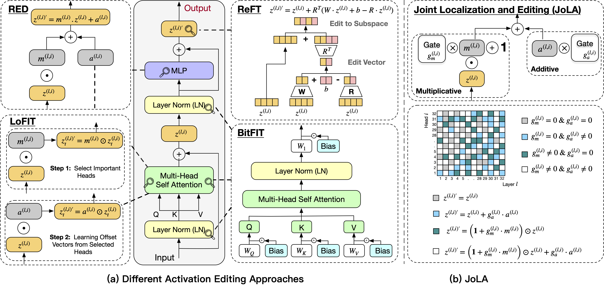

JoLA: Joint Localization and Activation Editing for Low-Resource Fine-Tuning
===

Code for the paper "JoLA: Joint Localization and Activation Editing for Low-Resource Fine-Tuning (ICML 2025)"

Paper: http://arxiv.org/abs/2502.01179

Authors: [Wen Lai](https://wenlai-lavine.github.io/)$^{1,2}$, [Alexander Fraser](https://alexfraser.github.io/)$^{1,2}$, [Ivan Titov](https://ivan-titov.org/)$^{3,4}$

$^1$ Technical University of Munich, $^2$ Munich Center for Machine Learning, $^3$ University of Edinburgh, $^4$ University of Amsterdam

Email: wen.lai@tum.de

## Overview

> Parameter-efficient fine-tuning (PEFT) methods, such as LoRA, are commonly used to adapt LLMs. However, their effectiveness is often limited in low-resource scenarios with only a few hundred examples. Recent advances in interpretability research have inspired the emergence of activation editing techniques, which modify the activations of specific model components. These methods, due to their extremely small parameter counts, show promise for small datasets. However, their performance is highly dependent on identifying the correct modules to edit and often lacks stability across different datasets. In this paper, we propose Joint Localization and Activation Editing (JoLA), a method that jointly learns (1) which heads in the Transformer to edit; (2) whether the intervention should be additive, multiplicative, or both and (3) the intervention parameters themselves - vectors applied as additive offsets or multiplicative scalings to the head output. Through evaluations on three benchmarks spanning commonsense reasoning, natural language understanding, and natural language generation, we demonstrate that JoLA consistently outperforms existing methods.

## Installation
+ Install **`jola`** from pip:
```bash
pip install jola
```
+ or, install our latest **`jola`** from pip+git:
```bash
pip install git+https://github.com/wenlai-lavine/jola.git
```

## Supported Models
JoLA currently supports the following model architectures:
- **LLaMA Models**: Full support for LLaMA-2 and LLaMA-3 variants
- **Qwen2 Models**: Full support for Qwen2 variants  
- **OLMo-2 Models**: Full support for OLMo-2 variants including the [OLMo-2-1124-13B-Instruct-32k-Context-ChatML](https://huggingface.co/sp-embraceable/OLMo-2-1124-13B-Instruct-32k-Context-ChatML) model

## Supported Datasets
JoLA supports various dataset formats:
- **Instruction-Response**: Standard instruction-following format
- **ShareGPT**: Conversation-style datasets in JSONL format
- **ChatML**: Structured conversation format for OLMo-2 models

## Training JoLA with a few codes

### For LLaMA Models
```py
from jola import JoLAConfig, JoLAModel, JoLATrainer, data_from_list
from transformers import AutoTokenizer, TrainingArguments

# set default=False, if you want to specify the parameters in JoLA; you need to set the configuration by providing a yaml file (example: config.yaml).
jola_config = JoLAConfig(default=True)

# load tokenizer
jola_tokenizer = AutoTokenizer.from_pretrained(**jola_config["model_config"])

# Load models
jola_model = JoLAModel.jola_from_pretrained(**jola_config["model_config"])

# unfreeze jola parameters
jola_model.unfreeze_jola_params()

# set in training mode
jola_model.model.train()

# examples from ARC-e
training_examples = [
    "Which statement best explains why photosynthesis is the foundation of most food webs?\n\nAnswer1: Sunlight is the source of energy for nearly all ecosystems. Answer2: Most ecosystems are found on land instead of in water. Answer3: Carbon dioxide is more available than other gases. Answer4: The producers in all ecosystems are plants.", "answer1",
    "Which piece of safety equipment is used to keep mold spores from entering the respiratory system?\n\nAnswer1: safety goggles Answer2: breathing mask Answer3: rubber gloves Answer4: lead apron.", "answer2",
    ... ...
]

# data setting, data loader
data_collator = make_data_collator(tokenizer=jola_tokenizer)

# dataset setting
jola_dataset = JoLADataset(train_list=training_examples)
jola_data = jola_dataset.data_from_list()
# training arguments
training_args = TrainingArguments(**jola_config["training_config"])
# trainer
jola_trainer = JoLATrainer(
    jola_model,
    train_dataset=jola_data['train'],
    eval_dataset = jola_data['valid'],
    tokenizer=jola_tokenizer,
    data_collator = data_collator,
    args=training_args,
    callbacks=[early_stopping_callback],
    gate_scheduler=jola_config["jola_config"]["gate_scheduler"]
)

jola_trainer.train()
```

### For OLMo-2 Models
```py
from jola import JoLAConfig, JoLAOlmo2Model, JoLATrainer, data_from_list
from transformers import AutoTokenizer, TrainingArguments

# Use OLMo-2 specific configuration
jola_config = JoLAConfig.get_jola_config(default=False, config_path="jola/config_olmo2.yaml")

# load tokenizer
jola_tokenizer = AutoTokenizer.from_pretrained(**jola_config["model_config"])

# Load OLMo-2 model
jola_model = JoLAOlmo2Model.jola_from_pretrained(**jola_config["model_config"])

# unfreeze jola parameters
jola_model.unfreeze_jola_params()

# set in training mode
jola_model.model.train()

# Define padding token if needed
if jola_tokenizer.pad_token is None:
    jola_tokenizer.add_special_tokens({'pad_token': '[PAD]'})
    jola_model.resize_token_embeddings(jola_model.config.vocab_size + 1)

# data setting, data loader
data_collator = make_data_collator(tokenizer=jola_tokenizer)

# dataset setting
jola_dataset = JoLADataset(data_path=jola_config["data_config"]["data_path"])
jola_data = jola_dataset.data_from_file()

# training arguments
training_args = TrainingArguments(**jola_config["training_config"])

# trainer
jola_trainer = JoLATrainer(
    jola_model,
    train_dataset=jola_data['train'],
    eval_dataset = jola_data['valid'],
    tokenizer=jola_tokenizer,
    data_collator = data_collator,
    args=training_args,
    callbacks=[early_stopping_callback],
    gate_scheduler=jola_config["jola_config"]["gate_scheduler"]
)

jola_trainer.train()
```

### For ShareGPT Data with OLMo-2
```py
from jola import JoLAConfig, JoLAOlmo2Model, JoLATrainer, ShareGPTDataset
from transformers import AutoTokenizer, TrainingArguments

# Use ShareGPT specific configuration
jola_config = JoLAConfig.get_jola_config(default=False, config_path="jola/config_sharegpt.yaml")

# load tokenizer
jola_tokenizer = AutoTokenizer.from_pretrained(**jola_config["model_config"])

# Load OLMo-2 model
jola_model = JoLAOlmo2Model.jola_from_pretrained(**jola_config["model_config"])

# unfreeze jola parameters
jola_model.unfreeze_jola_params()

# dataset setting - ShareGPT dataset
jola_dataset = ShareGPTDataset(
    data_path=jola_config["data_config"]["data_path"],
    train_size=jola_config["data_config"]["train_size"],  # 2000 samples
    valid_size=jola_config["data_config"]["valid_size"],
    test_size=jola_config["data_config"]["test_size"],
    format_type=jola_config["data_config"]["format_type"]  # "chatml"
)
jola_data = jola_dataset.load_data()

# trainer
jola_trainer = JoLATrainer(
    jola_model,
    train_dataset=jola_data['train'],
    eval_dataset=jola_data['valid'],
    tokenizer=jola_tokenizer,
    data_collator=data_collator,
    args=training_args,
    gate_scheduler=jola_config["jola_config"]["gate_scheduler"]
)

jola_trainer.train()
```


## Experiments in Paper

#### Dataset
We evaluate on commonsense reasoning, natural language understanding and natural language generation benchmarks.
+ Commonsense Reasoning
    - The same as [Hu et al., 2023](https://aclanthology.org/2023.emnlp-main.319/)
    - 8 Tasks: ARC-c / ARC-e / BoolQ / HellaSwag / OBQA / PIQA / SIQA / WinoGrande
    - [Download Link](https://github.com/AGI-Edgerunners/LLM-Adapters)
+ Natural Language Understanding
    - We use MMLU-Pro Benchmark ([Wang et al., 2024](https://arxiv.org/abs/2406.01574))
    - 14 Domains: Biology, Business, Chemistry, Computer Science, Economics, Engineering, Health, History, Law, Math, Philosophy, Physics, Psychology, and Others
    - [Download Link](https://huggingface.co/datasets/TIGER-Lab/MMLU-Pro)
+ Natural Language Generation
    - We use [GEM Benchmark](https://gem-benchmark.com/) ([Gehrmann et al., 2022](https://arxiv.org/abs/2206.11249))
    - We use 4 tasks: CommonGen / E2E_NLG / Web_NLG / Xsum
    - [Download Link](https://huggingface.co/datasets/GEM/gem)
    - Prompt Template from [PromptSource](https://github.com/bigscience-workshop/promptsource)

#### Training and Evaluation
+ please use your own ```config.yaml```
+ ```python examples/run_jola.py```

## Citation

[](https://doi.org/10.48550/arXiv.2502.01179)

Please cite our paper if it's helpful to your work!
```
@article{lai2025joint,
  title={Joint Localization and Activation Editing for Low-Resource Fine-Tuning},
  author={Lai, Wen and Fraser, Alexander and Titov, Ivan},
  journal={arXiv preprint arXiv:2502.01179},
  year={2025}
}
```
